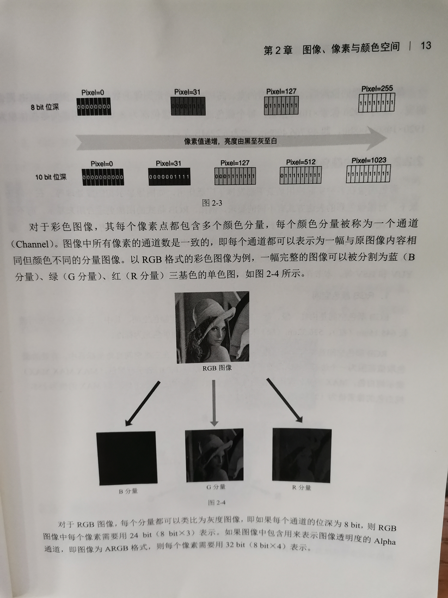

# Raster graphics

## wikipedia [Raster graphics](https://en.wikipedia.org/wiki/Raster_graphics)

## wikipedia [Pixel](https://en.wikipedia.org/wiki/Pixel)

> NOTE:
>
> 
>
> 颜色分量=color component=[channel (digital image)](https://en.wikipedia.org/wiki/Channel_(digital_image))=通道 ;颜色分量
>
> 
>
> 位深=[color depth](https://en.wikipedia.org/wiki/Color_depth)=[bit depth](https://en.wikipedia.org/wiki/Bit_depth_(computer_graphics)) ;

## wikipedia [Color depth](https://en.wikipedia.org/wiki/Color_depth)

**Color depth** or **colour depth** (see [spelling differences](https://en.wikipedia.org/wiki/American_and_British_English_spelling_differences#-our,_-or)), also known as **[bit depth](https://en.wikipedia.org/wiki/Bit_depth_(computer_graphics))**, is either the number of [bits](https://en.wikipedia.org/wiki/Bit) used to [indicate](https://en.wikipedia.org/wiki/User_interface) the color of a single [pixel](https://en.wikipedia.org/wiki/Pixel), or the number of bits used for each color component of a single pixel. 

## wikipedia [Channel (digital image)](https://en.wikipedia.org/wiki/Channel_(digital_image))

## draft

[intensity](https://en.wikipedia.org/wiki/Intensity_(physics))  亮度

