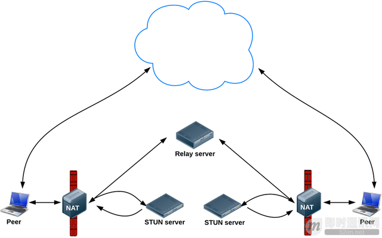

# P2P技术之STUN、TURN、ICE

一、在 baijiahao.baidu [实时音视频入门学习：开源工程WebRTC的技术原理和使用浅析](https://baijiahao.baidu.com/s?id=1721644496896867783&wfr=spider&for=pc) 中，有如下描述:

> **统一化和标准化对传统音视频交互环境差异性的规避：**
>
> *1）*以往音视频交互需要面对不同的 NAT 、防火墙对媒体 P2P 的建立带来了很大的挑战；
>
> *2）*现在WebRTC 中有P2P 打洞的开源项目 libjingle ,支持 STUN，TURN 等协议。

> WebRTC是基于浏览器端到端的连接（P2P）实现的.
>
> 由于不需要服务器中转，所以获取连接对象的网络地址的方式，是借助于ICE、STUN、TURN等**辅助内网穿透技术**（NAT）得到对应主机的公网网络地址和端口等网络定位信息。

> **STUN服务器用于辅助内网穿透得到对应主机的公网网络地址和端口信息图：**
>
> 
>
> 

显然，它们属于 "**辅助内网穿透技术**（NAT）"。

## STUN

一、在 baijiahao.baidu [实时音视频入门学习：开源工程WebRTC的技术原理和使用浅析](https://baijiahao.baidu.com/s?id=1721644496896867783&wfr=spider&for=pc) 中，有如下描述:

> STUN服务器用于辅助内网穿透得到对应主机的公网网络地址和端口信息图

### wikipedia [STUN](https://en.wikipedia.org/wiki/STUN)

### bloggeek [STUN](https://bloggeek.me/webrtcglossary/stun/#)

## 素材

1、P2P技术之STUN、TURN、ICE详解

https://zhuanlan.zhihu.com/p/488135992

2、libjingle

stackoverflow [How does WebRTC use libjingle?](https://stackoverflow.com/questions/10695205/how-does-webrtc-use-libjingle)